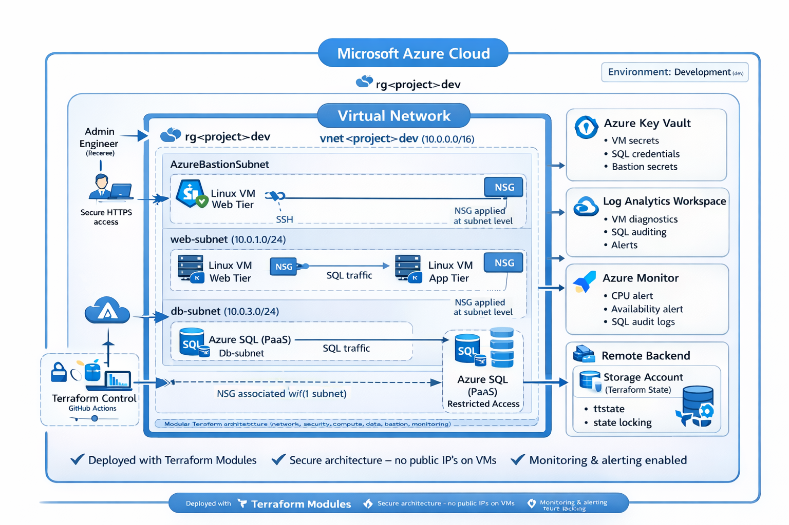
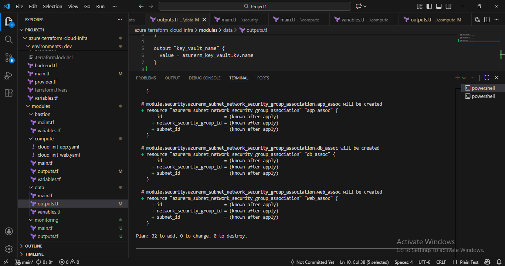

# Azure Enterprise Cloud Infrastructure – Terraform Reference Architecture

Production-style Azure infrastructure deployed using Terraform, featuring secure networking, multi-tier architecture, secret management, monitoring, and remote state management.

---

## Architecture




## Terraform Project Structure (VS Code)

The screenshot below shows the modular Terraform repository structure
used to provision Azure infrastructure following best practices.



---

## Key features

- Modular Terraform architecture  
- Secure network segmentation  
- Zero public IPs on virtual machines  
- Azure Bastion for secure access  
- Multi-tier Linux environment (web & app)  
- Azure SQL data platform  
- Key Vault–backed secret management  
- Centralized monitoring and alerting  
- Remote Terraform backend with state locking  

---

## What this project demonstrates

- Infrastructure as Code using Terraform modules  
- Secure Azure network design (VNet, subnets, NSGs, Bastion)  
- Multi-tier Linux architecture (web & app layers)  
- Azure SQL data layer  
- Secrets management with Azure Key Vault  
- Monitoring, diagnostics and alerting with Azure Monitor  
- Remote backend and state locking  
- Production-style environment separation  

---

## High-level architecture

This project deploys a secure, enterprise-style Azure environment:

- Virtual Network with segmented subnets (web, app, data, bastion)  
- Linux web VM exposed via controlled NSG rules (no direct public access)  
- Linux application VM isolated from the internet  
- Azure SQL Server used as the data layer  
- Azure Bastion for secure administrative access  
- Azure Key Vault for secret management  
- Log Analytics Workspace for centralized monitoring  
- Azure Monitor alerts for operational visibility  

All infrastructure is deployed using reusable Terraform modules.


## Repository structure

```
azure-terraform-cloud-infra/
│
├── backend/                     # Remote state backend configuration
├── environments/
│   └── dev/                     # Development environment (root module)
├── modules/
│   ├── network/                 # VNet, subnets, routing
│   ├── security/                # NSGs and security rules
│   ├── compute/                 # Linux VMs and NICs
│   ├── data/                    # Azure SQL and data services
│   ├── bastion/                 # Secure access layer
│   └── monitoring/              # Log Analytics and alerts
├── docs/
│   └── architecture.png
└── README.md


## Technologies used

- Microsoft Azure  
- Terraform  
- Azure Virtual Network  
- Azure Bastion  
- Azure Monitor & Log Analytics  
- Azure Key Vault  
- Azure SQL  
- Linux (Ubuntu)  

---

## Deployment guide

### Prerequisites

- Azure subscription  
- Azure CLI installed and authenticated  
- Terraform installed  

### Steps

```bash
git clone https://github.com/mojeed-88/azure-terraform-cloud-infra.git
cd azure-terraform-cloud-infra/environments/dev

terraform init
terraform validate
terraform plan
terraform apply


## Security design

- No public IPs on virtual machines
- Access only through Azure Bastion
- Network Security Groups isolate each subnet
- Secrets stored in Azure Key Vault
- Remote Terraform state stored securely in Azure Storage
- SQL protected inside private network


## Monitoring & operations

- Log Analytics Workspace collects diagnostics
- VM and SQL monitoring enabled
- Azure Monitor alerts configured (CPU, availability)
- Centralized observability for troubleshooting


## Design decisions

- Modular Terraform structure for scalability and reuse
- Subnet separation to follow enterprise network patterns
- Bastion instead of public IPs for secure management
- Remote backend to support teamwork and automation
- Monitoring added from day one to simulate production readiness


## Author

Mojeed Tijani
Azure Cloud Engineer
AZ-104 – Microsoft Azure Administrator
KCNA – Kubernetes and Cloud Native Associate
FinOps Certified Engineer
